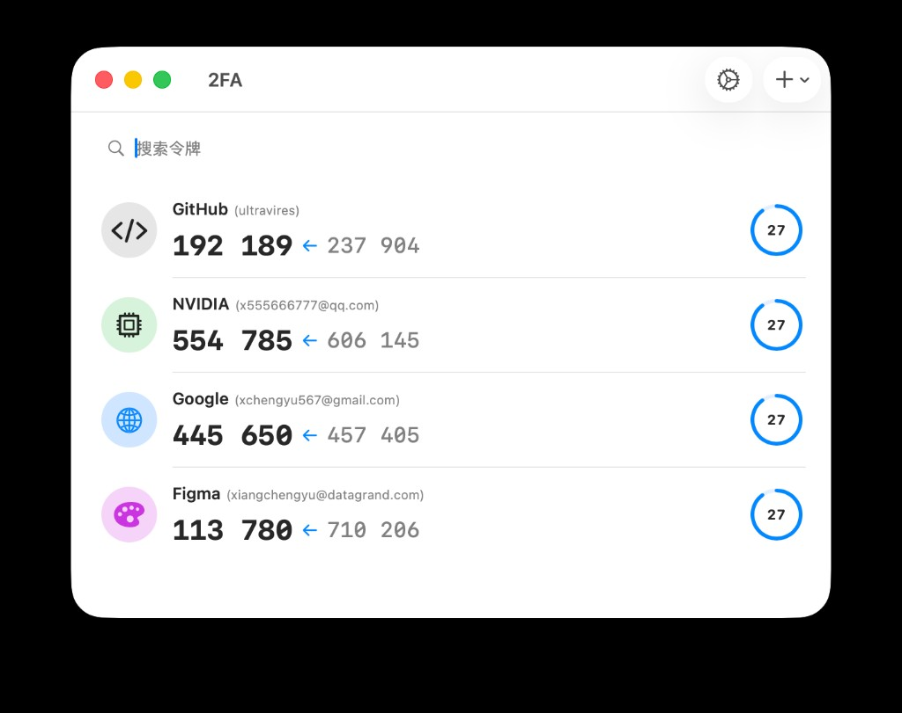
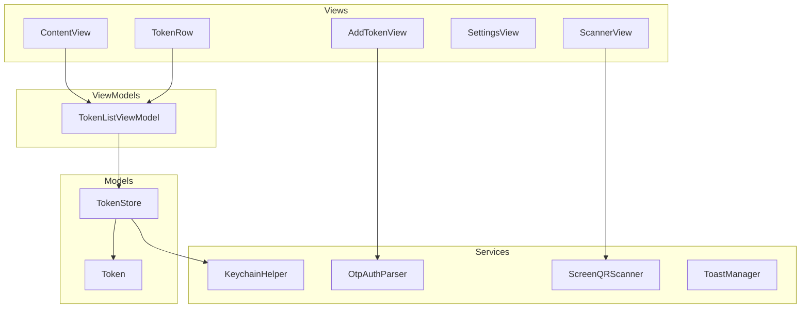

# 2FA

一款面向 **macOS** 的桌面应用，用于管理 **TOTP（基于时间的一次性密码）** 令牌：实时显示 6 位验证码、周期倒计时、可选下一时段预览，并支持搜索、添加与设置。

## 功能概览

- **多账户列表**：按发行方（Issuer）与账户名展示，支持常见服务的图标样式展示  
- **实时 TOTP**：基于 [SwiftOTP](https://github.com/lachlanbell/SwiftOTP) 生成标准 TOTP 码  
- **倒计时与进度**：每周期剩余秒数与环形进度  
- **搜索**：按发行方或账户关键字过滤  
- **添加令牌**：支持 `otpauth://` 解析及二维码相关流程（含独立扫描窗口，需相应系统权限）  
- **数据与隐私**：密钥通过 Keychain 相关逻辑处理；元数据持久化；设置中可调整主题与语言等  

## 运行截图



## 项目架构

本仓库为 **Swift Package Manager** 管理的可执行目标，UI 采用 **SwiftUI**，整体为「视图 + 视图模型 + 存储/服务」分层：



| 目录 / 模块 | 说明 |
|-------------|------|
| `2FA/App.swift` | 应用入口，`WindowGroup` 主窗口与扫描窗口 |
| `2FA/Models/` | `Token` 模型与 `TokenStore`（ObservableObject，持久化与导入导出） |
| `2FA/ViewModels/` | `TokenListViewModel`：TOTP 计算、周期时间与进度 |
| `2FA/Views/` | SwiftUI 界面：主列表、行、设置、添加、扫描等 |
| `2FA/Services/` | Keychain、OTP 解析、屏幕二维码、Toast 等 |
| `Support/Info.plist` | 打包为 `.app` 的 Bundle 信息（最低系统版本、权限说明等） |
| `scripts/` | 图标生成与打包脚本 |

**依赖**：`SwiftOTP`（TOTP 算法实现）。

**系统要求**：macOS 13.0+（见 `Package.swift` 与 `Info.plist`）。

## 如何构建

在仓库根目录执行：

```bash
swift build
```

调试运行（不打包 `.app`）：

```bash
swift run
```

发布优化构建：

```bash
swift build -c release
```

## 如何打包

使用项目提供的脚本将 **Release 可执行文件** 与 **Info.plist、应用图标** 组装为 macOS 应用包：

```bash
./scripts/package-app.sh
```

默认输出目录为 **`dist/2FA.app`**。也可指定输出目录：

```bash
./scripts/package-app.sh /path/to/output
```

脚本会：

1. 生成 `AppIcon.icns`（输出至 `Support/.generated/`）  
2. 执行 `swift build -c release`  
3. 创建 `*.app` 目录结构，复制二进制、`Info.plist` 与图标  

安装或试用：

```bash
open dist/2FA.app
```

如需分发，请自行配置代码签名、公证（Notarization）与 `hardened runtime` 等策略；本仓库脚本仅负责本地打包目录结构。
